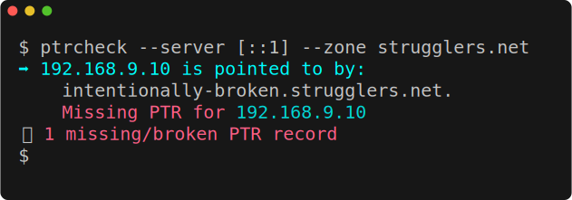
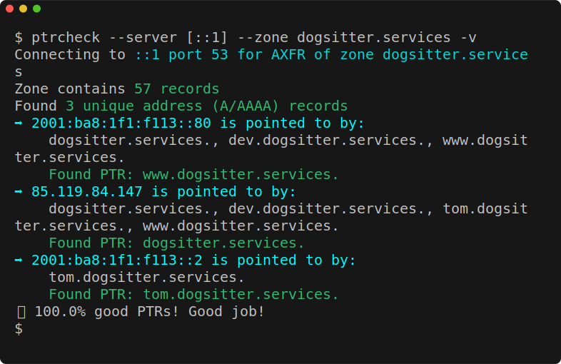

# showing-terminal-output

Noodling around with choices for displaying terminal output on GitHub.

So let's say we have three examples of Linux terminal output that makes use of
ANSI color sequences and emoji. How to best to showcase these on GitHub, from
a Markdown document?

The obvious choices seem to be:

- PNG image file
- SVG document
- Link out to HTML

Which ends up looking best for you? Do the emoji show up in the SVGs?

## PNG image file

### Typical run

<a href="https://raw.githubusercontent.com/grifferz/showing-terminal-output/main/ptrcheck-typical.png">
    
</a>

### Verbose run

<a href="https://raw.githubusercontent.com/grifferz/showing-terminal-output/main/ptrcheck-verbose.png">
    
</a>

### Another verbose run

<a href="https://raw.githubusercontent.com/grifferz/showing-terminal-output/main/ptrcheck-verbose2.png">
    
</a>

### Observations

A screenshot to an image is going to be great for exactly replicating how
these things look for me on my screen, but I have concern that my display is
going to be of a very different resolution to the reader's. If they need to
zoom in to see it better it's not going to scale well.

My other major concern is that it's not accessible to those using screen
readers. I mean I _can_ include a gigantic alt text but that's quite
difficult.

Just adding these as

```
<a href="https://raw.githubusercontent.com/grifferz/showing-terminal-output/main/ptrcheck-typical.png">

</a>
```

seems to result in an embedded image with the width of the browser that links
to the raw file (without that it links to the repository page).

Obviously these are at all different zoom levels because they're being
stretched to the browser width while the images themselves are of different
widths, resulting in inconsistent font size between each example. I could have
fixed that by making each image file have the same width but I did not out of
concern for having the highest resolution image that I could.

## SVG document

### Typical run

<a href="https://raw.githubusercontent.com/grifferz/showing-terminal-output/main/ptrcheck-typical.svg">
    
</a>

### Verbose run

<a href="https://raw.githubusercontent.com/grifferz/showing-terminal-output/main/ptrcheck-verbose.svg">
    
</a>

### Another verbose run

<a href="https://raw.githubusercontent.com/grifferz/showing-terminal-output/main/ptrcheck-verbose2.svg">
    
</a>

### Observations

It's possible to do a screenshot to SVG that directly uses the actual text
from the terminal so in theory it's friendly to copy and paste and screen
readers. In practice I have no idea if that is the case. It should also zoom
in and out nicely.

Beyond the basics of monospace font rendering I'm unsure if there will be
problems with missing font glyphs for emojis. The examples on this page use:

- :fire: `:fire:`
- :sparkles: `:sparkles:`
- :trophy: `:trophy:`

These SVGs were generated with
[freeze](https://github.com/charmbracelet/freeze). The command line looked
something like this:

```bash
$ freeze \
    -o ptrcheck-typical.svg \
    --font.family "monospace" \
    --font.size "20" \
    --window \
    --border.radius "8" < typical.txt
```

with `typical.txt` being generated by this process:

1. Attach to `tmux` session.
1. `echo $TMUX_PANE`.
1. Set up terminal exactly how I want, e.g. with a nice big font, extremely
   plain prompt and a sensible number of columns like 60.
1. Run command to be captured.
1. Adjust terminal size vertically so all it has in it is the command output,
   no wasted blank space.
1. In another pane: `tmux capture-pane -pet X > typical.txt` where the `X` is
   the `TMUX_PANE` from step #2.

The pane capture could be piped directly through `freeze` if it's all
happening on the same host, e.g.:

```bash
$ tmux capture-pane -pet 2 | freeze … -o ptrcheck-typical.svg
```

`freeze` does also have a config file to avoid having to specify all these
lengthy options each time.

Some notes:

- Default font-family and size would be `JetBrains Mono` and size `14px`
  unless I made those changes.
- `--window` is what adds the fake Mac terminal decoration. I'm not thrilled
  with it but it's perhaps useful to indicate that this is a terminal.

My immediate observation is that since I just had to set
`font-family: monospace` in there then this is very unlikely to show up
exactly like screenshots of my terminal (where I use CommitMono). It's
possible to tell `freeze` to embed a font into the SVG but that will make the
SVG literally megabytes in size. I'm not sure these examples really need it.

It doesn't seem to be possible to copy/paste or scale the SVGs from the
Markdown view but clicking/tapping on them leads to the actual SVG file which
you _can_ zoom in and out on and they should retain the crispness. For me it
is also possible then to copy/paste the actual text.

So my experience with this is quite positive. I think I like it better than
the PNGs.

## Link out to HTML

HTML is problematic here as GitHub is quite limited in what it allows to be
embedded in Markdown, and for good reason: allowing all manner of styling
would lead to GitHub looking like Geocities. It may be possible to link out to
a HTML file hosted in the repository, or to a GitHub pages site, but I'm most
interested in this being workable from the repository view of GitHub.

I'm not going to pursue this option for now. It's a pity because outside of
the constraints of GitHub I think this would be the best option for presenting
textual information.
